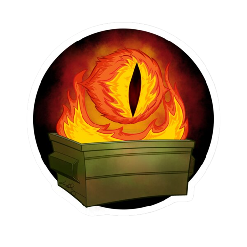

> Disclamer: This Image is broken by design and is dedicated to learn some techniques to dive into a dumpster and search for treasures

 
 

## What things do you need?

* [dive](https://github.com/wagoodman/dive) to see each of the docker layers
* [moby/download-frozen-image-v2.sh](https://github.com/moby/moby/blob/master/contrib/download-frozen-image-v2.sh) to download the image (layers)
* jq and some linux knowledge will help you
* docker installed (that might help to extract files and debug)

## Broken Base-Image
The baseline of most setups is a a felxible base image. In most cases developers tend to make their life flexible and install things as fast as possible. Sometimes they tend to do a lot of silly things to achive this. Some of these things I encountered during my daily work as a developer made it directly into this side project. 

 The almighty eye of the dumpster fire is watching you 

